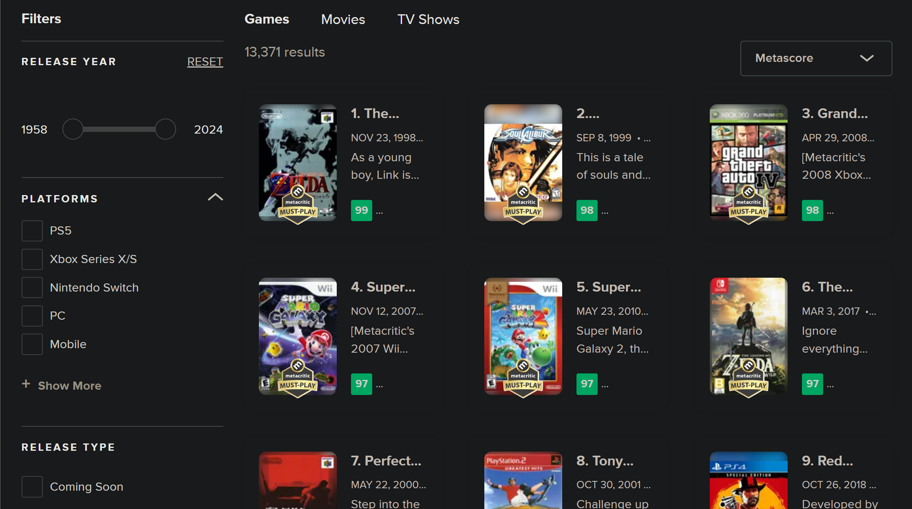

# Metacritic Games App

This application allows you to explore the highest-rated games on Metacritic, displaying details such as release dates, ratings, and reviews. It is a proof-of-concept developed to demonstrate the use of React Native and Expo in creating a mobile and web application.

## Metacritic Screenshot

This is a screenshot of the Metacritic page, from which we scraped data on the top-rated games:

## App Functionality

Below is the application running on different platforms:

### PC

### Android

### iOS

## Technologies

- **React Native**: Framework for building mobile applications.
- **Expo**: Platform for developing and deploying React Native apps.
- **NativeWind**: Styling system based on Tailwind CSS.
- **Metacritic API**: Data source for games.
