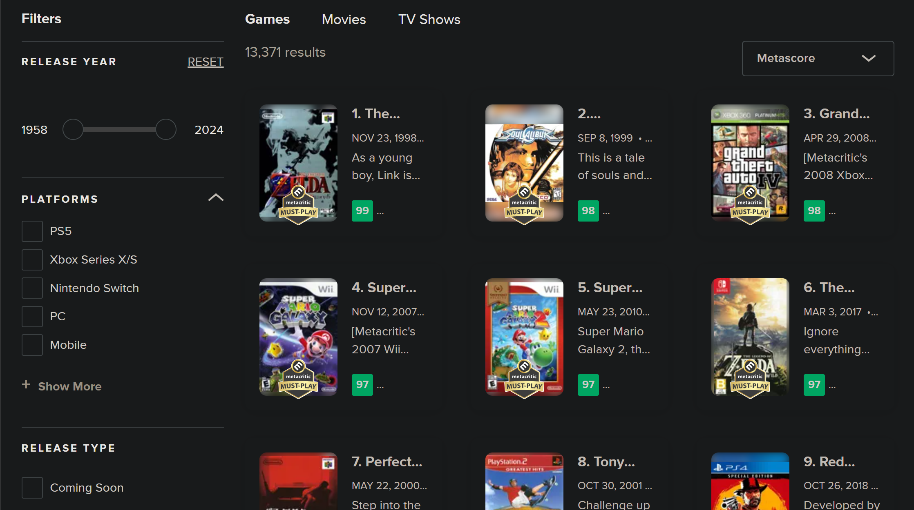

# Metacritic Games App

Esta aplicación te permite explorar los juegos mejor valorados en Metacritic, mostrando detalles como la fecha de lanzamiento, calificaciones y reseñas. Es una prueba de concepto desarrollada para demostrar el uso de React Native y Expo en la creación de una aplicación móvil y web.

## Captura de Metacritic

Esta es una captura de pantalla de la página de Metacritic, de donde scrapeamos los datos de los mejores juegos:

## Funcionamiento de la App

A continuación, se muestra la aplicación en funcionamiento en cada una de las plataformas:

### PC

### Android

### iOS

## Tecnologías

- **React Native**: Framework para construir aplicaciones móviles.
- **Expo**: Plataforma para construir y desplegar aplicaciones React Native.
- **NativeWind**: Sistema de estilos basado en Tailwind CSS.
- **Metacritic API**: Fuente de datos para los juegos.
